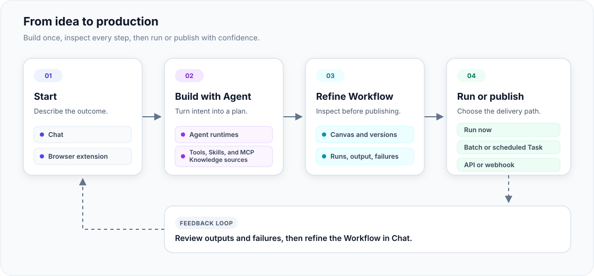

<p align="center">
  <picture>
    <source media="(prefers-color-scheme: dark)" srcset="web/public/branding/icon-dark.png">
    <source media="(prefers-color-scheme: light)" srcset="web/public/branding/icon-light.png">
    
  </picture>
</p>

<h1 align="center">Flowork</h1>

<p align="center">
  <strong>Build, preview, automate, and deploy with AI agents, visual workflows, tasks, and your browser—all in one platform.</strong>
</p>

<p align="center">
  A self-hosted platform for building, running, and publishing AI-assisted
  automation.
</p>

<p align="center">
  <a href="https://github.com/LYuhang/flowork/actions/workflows/ci.yml"></a>
  <a href="https://github.com/LYuhang/flowork/actions/workflows/security.yml"></a>
  <a href="LICENSE"></a>
  
  
  
</p>

<p align="center">
  English · <a href="README.zh-CN.md">简体中文</a>
</p>

<p align="center">
  <a href="#overview">Overview</a> ·
  <a href="#quick-start">Quick Start</a> ·
  <a href="#usage">Usage</a> ·
  <a href="#architecture">Architecture</a> ·
  <a href="#documentation">Documentation</a> ·
  <a href="SECURITY.md">Security</a> ·
  <a href="CONTRIBUTING.md">Contributing</a>
</p>

> [!IMPORTANT]
> Flowork is in alpha. Its core agent, workflow, storage, authorization,
> deployment, and sandbox services are implemented, but APIs and data models may
> change before the first stable release. Browser automation remains
> experimental.

> [!NOTE]
> **Live Demo:** [Try Flowork](https://20-55-50-206.sslip.io/). This public
> instance is provided for testing only; service availability and stability
> are not guaranteed.

## Overview

Flowork is an open-source platform for turning an agent conversation into a
runnable workflow. Start with a goal in Chat. The agent builds or modifies the
same workflow graph that appears on the visual canvas, so the structure,
versions, runs, outputs, and failures remain visible throughout the process.

Once the workflow behaves as intended, run it on demand, in a batch, or on a
schedule, or publish it as an API or webhook. Agent and workflow execution is
isolated from the control plane through the sandbox service.

### How Flowork works

```text
Describe a goal
      ↓
Build or modify a workflow in Chat
      ↓
Inspect and refine the graph on the canvas
      ↓
Run and verify it in an isolated sandbox
      ↓
Reuse it or publish it as an automated service
```

What makes Flowork different:

- 🪄 **Agent-built workflows** — The agent edits and validates the real workflow
  graph rather than returning a separate suggestion or diagram.
- 🔎 **Visible from intent to result** — Plans, nodes, versions, runs, outputs,
  and failures remain inspectable from Chat and the canvas.
- ♻️ **Reusable automation** — Convert one-off agent work into a durable,
  versioned workflow that can run again or be published.
- 🧩 **Extensible agent capabilities** — Combine LangChain or Codex with MCP
  servers, Skills, Knowledge, SubAgents, and browser control.
- 🛡️ **Self-hosted execution boundaries** — Keep control of models and data
  while routing untrusted execution through isolated sandboxes.

## Quick Start

### Installation

#### Docker Compose (recommended)

Install Docker Engine or Docker Desktop with Compose v2, then start the local
stack:

```bash
git clone https://github.com/LYuhang/flowork.git
cd flowork
./scripts/deploy/local_server.sh up
```

The launcher generates local secrets, builds the services, waits for their
health checks, and verifies the deployment. The first build can take several
minutes.

#### Native Linux or WSL

Use the native bootstrap when developing on Debian, Ubuntu, or WSL:

```bash
./scripts/bootstrap_native_linux.sh
```

For prerequisites, manual setup, local configuration, and production guidance,
see the [installation guide](docs/installation.md).

### Common Commands

| Action | Docker Compose | Native Linux/WSL |
| --- | --- | --- |
| Start | `./scripts/deploy/local_server.sh up` | `./launch.sh start` |
| Stop | `./scripts/deploy/local_server.sh stop` | `./launch.sh stop` |
| Restart | `./scripts/deploy/local_server.sh restart` | `./launch.sh restart` |
| Status | `./scripts/deploy/local_server.sh status` | `./launch.sh status` |
| Logs | `./scripts/deploy/local_server.sh logs` | `./launch.sh logs` |

Open <http://localhost:9001> after startup verification succeeds.

### Build your first workflow

1. **Choose an Agent runtime.** Open **Settings → Agent runtime** and select the
   default runtime for new Chats:
   - **LangChain** uses model-provider credentials and the LangChain Agent
     toolset.
   - **Codex** runs conversations through the Codex runtime.

   Only runtimes enabled by the deployment are shown. The selection applies to
   new Chats; an existing Chat keeps the runtime with which it was created.

2. **Connect a model or account.** Complete the connection required by the
   selected runtime:
   - Open **Settings → API credentials** to connect OpenRouter or add a
     write-only provider key. OpenAI, Azure OpenAI, Anthropic, Google Gemini,
     and custom providers are supported where they are compatible with the
     selected Runtime. OpenRouter connection requires the deployment's
     canonical `VIBECANVAS_PUBLIC_URL` for its secure callback.
   - For **Codex**, either open **Settings → Agent runtime → Codex account** and
     sign in with an OpenAI account using the device code, or open
     **Settings → API credentials** and add an OpenAI or Azure OpenAI
     credential. A connected OpenRouter account also contributes its compatible
     text and tool-calling models through the OpenRouter Responses API.
     Deployment-managed API models may already be available without a personal
     key.

   A model appearing in the OpenRouter catalog does not guarantee current
   account quota or provider availability; OpenRouter applies its own credit
   and rate-limit policy when the model is invoked.

   The available connection methods depend on the deployment configuration.
   Stored API keys are encrypted and write-only: they cannot be read back from
   the application after saving. The application filters every source by the
   selected Runtime and API protocol before displaying its models.

3. **Start a Chat and build the Workflow.** Open **Chat**, create a new
   conversation, choose a source and model below the composer, and select a
   supported thinking level when the model exposes one. The first accepted
   turn fixes both the Runtime and the exact account/API connection for that
   Chat. Between turns, the model and thinking level can still be changed
   within that connection; start a new Chat to use another source. Activate
   `/workflow`, then describe the automation you want to create,
   including its expected inputs, outputs, and important constraints. Inspect
   the generated Workflow on the canvas, validate and run it, then review the
   node outputs and refine the Workflow in Chat or on the canvas.

The workflow remains available as a versioned asset after the conversation ends.
Publish it only after its inputs, outputs, and failure behavior have been
verified.

## Usage

Most work begins in Chat, where the user describes what they need. When the task
involves an authenticated website, the conversation can start from the browser
extension instead. The agent uses tools to build a Workflow, which the user can
inspect and refine on the canvas. The Workflow can then run directly, through a
batch or scheduled Task, or as an API or webhook Deployment that external
systems can call.



The diagram shows a common path, not a set of mandatory dependencies. A Workflow
can be tested directly on the canvas or handed to a Task for batch or scheduled
execution. Once published, API and webhook calls can start new Runs without
repeating the original build conversation, while recurring execution remains a
Task responsibility.

### Main Application

| Surface | What you can do | Demo |
| --- | --- | --- |
| **Chat** | Describe a request in conversation and let a LangChain or Codex agent use tools, build Workflows, create diagrams, and organize files. Preview Workflows, background jobs, common documents, tables, media, and diagrams beside the conversation. Each Chat has its own workspace, with a sandbox that starts, hibernates, and restores as needed. | <video src="https://github.com/user-attachments/assets/13822cb0-e943-4d8d-87fb-71ff0a5cfb13" controls></video> |
| **Workflow** | Add, connect, and configure nodes on a visual canvas, validate the graph, and execute either the full Workflow or an individual node. Review run output, generated files, and earlier versions, or use batch execution and JSON import and export. | <video src="https://github.com/user-attachments/assets/ecd228f9-dc1a-401f-bbd0-840ce5b31521" controls></video> |
| **Task** | Run a Workflow across a tabular input file or schedule it for a particular time or interval. Task Center shows queue and execution progress, events, output, and failures, and lets users pause, cancel, or resume work where supported. | <video src="https://github.com/user-attachments/assets/7f959eeb-4c72-4d9a-b18a-02d548fb4b1b" controls></video> |
| **Deployment** | Publish a verified Workflow as an API or webhook for external systems. Each Deployment provides its invocation details, code examples, test requests, traffic controls, credentials, run history, and health metrics. Use a scheduled Task when the Workflow needs to run on a recurring or calendar-based schedule. | <video src="https://github.com/user-attachments/assets/78539888-99a6-4c58-a04e-d8b41507ddd7" controls></video> |
| **Knowledge** | Organize reusable notes and multimodal references as versioned file packages. Each package starts with a README and can be progressively read, edited, and published by the Agent through `/knowledge`. See [Knowledge packages](docs/knowledge.md). | <video src="https://github.com/user-attachments/assets/288b1595-eb1d-4d81-b03b-d75b80e77fea" controls></video> |
| **MCP Server** | Find external tools through the Official MCP Registry or Smithery, or connect a custom server by URL or command. Review the source, requested access, and credential requirements before installation; after connection, the agent loads its tools when needed. | <video src="https://github.com/user-attachments/assets/621cdb1b-28f0-4e50-ad07-eeb13ab58a33" controls></video> |
| **Skills** | Find and install reusable instruction packages from sources such as OpenAI and Anthropic, or import a custom Skill. Review its instructions, bundled files, tool requirements, and source before making it available to agents. | <video src="https://github.com/user-attachments/assets/178f664e-0715-475e-9db5-c8d672742ea9" controls></video> |
| **Storage** | Browse platform files by shared mount, Workflow, Chat, or Task. Search, sort, upload, and download files, and—where permissions allow—create folders, rename or delete items, and preview or edit supported content. | <video src="https://github.com/user-attachments/assets/e7d7d418-7ad8-4dbe-97fc-0adeef7896ea" controls></video> |

#### Resource ownership and sharing

Workflows, Tasks, Deployments, and Knowledge packages created by a user keep
their original owner and provenance when shared. Personal resources are shared
by entering an exact account email; the recipient remains an external Guest
rather than becoming a member of the owner's personal workspace, and receives
only the selected resource-level role. A business organization can instead
share with an exact member email, an exact team or department path, or the
entire organization. Recipients find these resources under **Shared with me**,
and the effective role determines which actions are available.

Installed Skills and MCP servers, catalog entries, API credentials, and
platform-built-in resources are not shareable objects.

#### Chat Slash Commands

Slash Commands tell Flowork which specialized capabilities the current
conversation needs. Activating a command gives the agent the corresponding
tools and operating guidance for the rest of that Chat. Commands can be
combined when a task spans more than one area.

| Command | Purpose | Availability |
| --- | --- | --- |
| `/workflow` | Ask the agent to create or open a Workflow, then modify nodes, validate the graph, create versions, or run it from the conversation | Main app and extension; LangChain/Codex |
| `/task` | Ask the agent to find or manage Tasks, or export searchable event and execution diagnostics for troubleshooting | Main app and extension; LangChain/Codex |
| `/deployment` | Ask the agent to find or manage Deployments, or export searchable invocation logs and metrics for troubleshooting | Main app and extension; LangChain/Codex |
| `/knowledge` | Let the Agent read, create, and version Knowledge file packages in the active organization | Main app and extension; LangChain/Codex |
| [`/diagram`](docs/diagram.md) | Create and refine native draw.io diagrams with the official sandbox-local MCP, then preview and export them | Main app and extension; LangChain/Codex |
| `/document` | Create or revise professional PPTX, DOCX, XLSX, or PDF files, review their structure and rendered output, then publish the native file in Preview | Main app and extension; LangChain/Codex |
| `/browser` | Let the agent read or operate tabs and authenticated pages in the connected browser | Extension side panel only; LangChain/Codex |

### Browser Extension

The experimental Chrome MV3 extension connects a Chat to the current browser
session. It is intended for work that must reuse the user's current signed-in
state. Within its authorized scope, the agent can read pages, switch tabs,
click, type, select options, and take screenshots.

Download the extension package that matches the current deployment from
**Settings → Extensions → Download extension**. Extract the ZIP to a permanent
folder, open `chrome://extensions`, enable **Developer mode**, and choose
**Load unpacked**. Select the extracted folder, then pin Flowork and open its
side panel.

Developers can also build the extension from source:

```bash
cd extension
corepack enable
pnpm install --frozen-lockfile
pnpm test
pnpm build
```

Load `extension/dist` with **Load unpacked**, open the side panel, and activate
`/browser`. The command is unavailable in the main application because browser
control requires the extension's scoped connection to the active tab.

## Architecture

### System at a glance

Flowork separates platform management from task execution. The Web application
provides Chat, the visual canvas, and management pages. The FastAPI control
plane handles identity, authorization, persistence, orchestration, and live
event delivery. `sandboxd` places Agent and Workflow execution in isolated
sandboxes, while workers process background jobs, scheduled runs, knowledge
indexing, and batch execution.

```text
Browser / Chrome extension
            │
            ▼
        Web / Nginx
            │
            ▼
      FastAPI control plane ─── PostgreSQL / OpenFGA / object storage
            │
            ├── Valkey / Celery workers
            └── sandboxd ─── per-Chat agent runtime and workflow sandboxes
```

PostgreSQL is the system of record. OpenFGA and row-level security enforce
authorization boundaries, object storage holds durable file content, and
Valkey provides queueing and transient coordination. The sandbox service keeps
agent and workflow execution outside the API process.

See the [architecture guide](docs/architecture.md) for runtime lifecycle, MCP
boundaries, storage ownership, authorization, and network isolation.

### Repository structure

```text
api/        FastAPI control plane, agent runtime, auth, storage, and workers
engine/     Framework-independent Python workflow execution engine
web/        React application and visual workflow canvas
extension/  Experimental Chrome MV3 browser integration
docs/       Public installation, architecture, security, and development guides
scripts/    Bootstrap, deployment, diagnostics, and security utilities
```

## Documentation

| Goal | Document |
| --- | --- |
| Install, configure, or troubleshoot a self-hosted instance | [Installation and deployment](docs/installation.md) |
| Understand components, runtime flow, storage, and isolation | [Architecture](docs/architecture.md) |
| Prepare and operate a production deployment | [Production deployment](DEPLOY.md) |
| Understand security controls and data lifecycle | [Security and data lifecycle](docs/security-and-data-lifecycle.md) |
| Set up a development environment and run checks | [Development guide](docs/development.md) |
| Contribute code or documentation | [Contributing guide](CONTRIBUTING.md) |

## Security

Do not report vulnerabilities through public GitHub issues. Follow the private
disclosure process in [SECURITY.md](SECURITY.md). Review the documented trust
boundaries and deployment requirements before using alpha releases with
sensitive data.

## Contributing

Contributions are welcome. Read [CONTRIBUTING.md](CONTRIBUTING.md) before opening
an issue or pull request.

## License

Flowork is licensed under the [Apache License 2.0](LICENSE). Dependencies retain
their respective licenses; see [Third-party notices](THIRD_PARTY_NOTICES.md).


<!-- Product demo videos use GitHub user attachments for inline playback. -->
