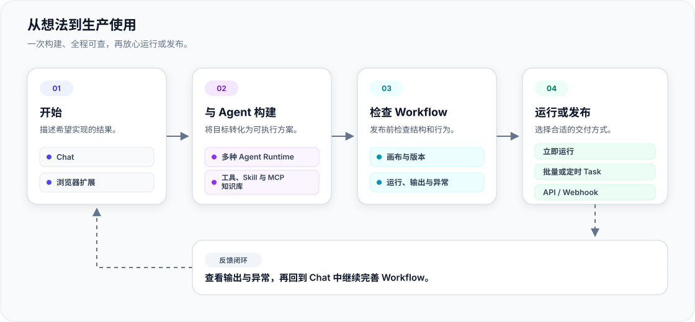

<p align="center">
  <picture>
    <source media="(prefers-color-scheme: dark)" srcset="web/public/branding/icon-dark.png">
    <source media="(prefers-color-scheme: light)" srcset="web/public/branding/icon-light.png">
    
  </picture>
</p>

<h1 align="center">Flowork</h1>

<p align="center">
  <strong>用 AI Agent、可视化工作流、任务和浏览器，在一个平台完成构建、预览、自动化与部署。</strong>
</p>

<p align="center">
  一个用于构建、运行和发布 AI 辅助自动化流程的自托管平台。
</p>

<p align="center">
  <a href="https://github.com/LYuhang/flowork/actions/workflows/ci.yml"></a>
  <a href="https://github.com/LYuhang/flowork/actions/workflows/security.yml"></a>
  <a href="LICENSE"></a>
  
  
  
</p>

<p align="center">
  <a href="README.md">English</a> · 简体中文
</p>

<p align="center">
  <a href="#项目简介">项目简介</a> ·
  <a href="#快速开始">快速开始</a> ·
  <a href="#使用说明">使用说明</a> ·
  <a href="#系统架构">系统架构</a> ·
  <a href="#文档">文档</a> ·
  <a href="SECURITY.md">安全</a> ·
  <a href="CONTRIBUTING.md">参与贡献</a>
</p>

> [!IMPORTANT]
> Flowork 目前处于 Alpha 阶段。Agent、工作流、存储、权限控制、部署和沙盒等核心服务已经实现，但 API 与数据模型在首个稳定版本发布前仍可能调整。浏览器自动化功能尚处于实验阶段。

> [!NOTE]
> **在线体验：**[访问 Flowork Demo](https://20-55-50-206.sslip.io/)。该公开实例仅供测试使用，服务的可用性与稳定性无法保证。

## 项目简介

Flowork 是一个将 Agent 对话转化为可执行工作流的开源平台。只需在 Chat 中描述目标，Agent 就会直接构建或修改可视化画布中的工作流图，而不是另外生成一份与实际执行脱节的建议或示意图。工作流的结构、版本、运行记录、输出和异常信息在整个过程中始终可见。

工作流通过验证后，可以按需运行、批量执行或设置定时任务，也可以发布为 API 或 Webhook，供外部系统调用。周期性执行由 Task 负责；Agent 与工作流的执行环境通过沙盒服务与控制平面隔离。

### Flowork 的工作方式

```text
描述目标
   ↓
在 Chat 中构建或修改工作流
   ↓
在可视化画布中检查并完善工作流图
   ↓
在隔离沙盒中运行和验证
   ↓
复用工作流，或将其发布为自动化服务
```

Flowork 的核心特点：

- 🪄 **由 Agent 直接构建工作流**：Agent 编辑并验证真实的工作流图，避免方案描述与实际执行逻辑相互脱节。
- 🔎 **从目标到结果全程可见**：计划、节点、版本、运行记录、输出和异常均可在 Chat 与画布中检查。
- ♻️ **将一次性任务转化为可复用自动化**：把 Agent 完成的临时工作沉淀为可持久化、可版本管理、可再次运行或发布的工作流。
- 🧩 **可扩展的 Agent 能力**：当前使用沙盒化 Codex，并通过 Runtime 中立的平台协议组合 MCP 服务、Skills、知识库、SubAgent 和浏览器控制能力。
- 🛡️ **自托管与隔离执行**：模型与数据由部署方掌控，Agent 与 Workflow 的代码执行统一进入隔离沙盒。

## 快速开始

### 安装

#### Docker Compose（推荐）

安装 Docker Engine，或安装包含 Compose v2 的 Docker Desktop，然后启动本地服务：

```bash
git clone https://github.com/LYuhang/flowork.git
cd flowork
./scripts/deploy/local_server.sh up
```

启动脚本会自动生成本地密钥、构建各项服务、等待健康检查完成，并验证部署结果。首次构建通常需要几分钟。

#### 原生 Linux 或 WSL

在 Debian、Ubuntu 或 WSL 环境中进行开发时，可使用原生环境初始化脚本：

```bash
./scripts/bootstrap_native_linux.sh
```

有关环境要求、手动安装、本地配置和生产部署的说明，请参阅[安装指南](docs/installation.md)。

### 常用命令

| 操作 | Docker Compose | 原生 Linux/WSL |
| --- | --- | --- |
| 启动 | `./scripts/deploy/local_server.sh up` | `./launch.sh start` |
| 停止 | `./scripts/deploy/local_server.sh stop` | `./launch.sh stop` |
| 重启 | `./scripts/deploy/local_server.sh restart` | `./launch.sh restart` |
| 查看状态 | `./scripts/deploy/local_server.sh status` | `./launch.sh status` |
| 查看日志 | `./scripts/deploy/local_server.sh logs` | `./launch.sh logs` |

服务启动并通过健康检查后，访问 <http://localhost:9001>。

### 创建第一个工作流

1. **查看 Agent Runtime。** 进入 **Settings → Agent Runtime**，查看新建 Chat 使用的运行时。当前版本由 **Codex** 在每个 Chat 的隔离沙盒中运行。Runtime 注册已封装在稳定协议之后，后续可以接入其他 Runtime，而无需把其 SDK 耦合进 API 服务。

2. **连接模型或账户。** 完成 Codex 所需的连接配置：
   - 进入 **设置 → API 凭据**，可以连接 OpenRouter，也可以手动添加只写的模型提供商 API Key。OpenAI、Azure OpenAI、Anthropic、Google Gemini 以及自定义提供商会在与所选 Runtime 兼容时显示。OpenRouter 的安全回调依赖部署方配置规范的 `VIBECANVAS_PUBLIC_URL`。
   - 使用 **Codex** 时，还可以进入 **设置 → Agent Runtime → Codex account**，通过设备验证码登录 OpenAI 账户。连接 OpenRouter 后，与 Codex 兼容的文本和工具调用模型也会通过 OpenRouter Responses API 提供。部署方统一配置的 API 模型无需添加个人凭据即可显示。

   模型出现在 OpenRouter 目录中，并不代表当前账户一定具有可用额度，也不代表上游提供商始终可用；真正调用时仍会受 OpenRouter 的余额与限流策略约束。

   实际可用的连接方式取决于部署配置。保存后的 API Key 会加密存储，并且只能写入，无法再从应用中读取。应用会先根据所选 Runtime 和 API 协议过滤连接来源，再展示可用模型。

3. **开始 Chat 并构建 Workflow。** 进入 **Chat** 并新建对话，在编辑框下方依次选择模型来源、具体模型，以及该模型支持的思考强度。首个被接受的 Turn 会固定该 Chat 的 Runtime 和具体账户/API 连接；后续仍可在同一连接内切换模型与思考强度。如需使用其它来源，请新建 Chat。启用 `/workflow`，然后描述需要实现的自动化任务、预期输入和输出，以及必要的约束条件。随后在画布中检查生成的 Workflow，完成验证和试运行，并根据节点输出继续通过 Chat 或画布完善流程。

对话结束后，工作流仍会作为可版本化资产保留。确认其输入、输出和异常处理行为符合预期后，再将工作流发布。

## 使用说明

用户通常从 Chat 开始，通过对话说明需求；需要操作已登录的网页时，也可以从浏览器扩展发起对话。Agent 会根据目标调用工具并构建 Workflow，用户可以在画布上继续检查和调整。Workflow 随后可以直接运行，也可以通过 Task 执行批处理或定时任务；验证通过后，再通过 Deployment 发布给外部系统调用。



图中展示的是一条典型使用路径，而不是模块之间的强制依赖关系。Workflow 可以在画布中直接试运行，也可以交给 Task 执行批量或定时任务；发布后，API 和 Webhook 调用能够继续触发新的 Run，无需重复最初的构建对话，而周期性执行仍由 Task 负责。

### 主应用

| 功能模块 | 用户可以做什么 | 演示 |
| --- | --- | --- |
| **Chat** | 通过对话描述需求，由 Codex Agent 调用工具、构建 Workflow、绘制图表和整理文件。Workflow、后台任务、常见文档、表格、媒体和图表都可以在对话旁直接预览。每个 Chat 拥有独立的工作空间，沙盒会随对话按需启动、休眠和恢复。 | <video src="https://github.com/user-attachments/assets/13822cb0-e943-4d8d-87fb-71ff0a5cfb13" controls></video> |
| **Workflow** | 在可视化画布上添加、连接和配置节点，检查工作流结构并执行整个流程或单个节点。运行结果、生成文件和历史版本可以集中查看，工作流也支持批量执行以及 JSON 导入和导出。 | <video src="https://github.com/user-attachments/assets/ecd228f9-dc1a-401f-bbd0-840ce5b31521" controls></video> |
| **Task** | 使用表格文件批量运行 Workflow，或者按指定时间和间隔创建定时任务。Task Center 会持续显示排队和执行进度、事件、输出与异常，并允许用户暂停、取消或恢复适用的任务。 | <video src="https://github.com/user-attachments/assets/7f959eeb-4c72-4d9a-b18a-02d548fb4b1b" controls></video> |
| **Deployment** | 将验证通过的 Workflow 发布为 API 或 Webhook，供外部系统调用。每个 Deployment 都提供调用信息、代码示例、在线测试、流量控制、凭据、运行历史与健康指标；如需按周期或指定日历时间执行 Workflow，请创建定时 Task。 | <video src="https://github.com/user-attachments/assets/78539888-99a6-4c58-a04e-d8b41507ddd7" controls></video> |
| **Knowledge** | 将可复用笔记与多模态资料整理为带版本的文件资料包。每个资料包以 README 为入口，Agent 可通过 `/knowledge` 渐进式读取、修改并发布。详见[知识资料包](docs/knowledge.zh-CN.md)。 | <video src="https://github.com/user-attachments/assets/288b1595-eb1d-4d81-b03b-d75b80e77fea" controls></video> |
| **MCP Server** | 从官方注册表或 Smithery 查找外部工具，也可以通过 URL 或命令接入自定义服务。安装前可以检查来源、访问范围和凭据要求，连接成功后 Agent 会在需要时加载相应工具。 | <video src="https://github.com/user-attachments/assets/621cdb1b-28f0-4e50-ad07-eeb13ab58a33" controls></video> |
| **Skills** | 查找并安装 OpenAI、Anthropic 等来源提供的可复用指令包，或导入自定义 Skill。安装前可以查看指令、附带文件、工具要求和来源，安装后由 Agent 按需加载。 | <video src="https://github.com/user-attachments/assets/178f664e-0715-475e-9db5-c8d672742ea9" controls></video> |
| **Storage** | 按共享挂载、Workflow、Chat 和 Task 浏览平台文件。用户可以搜索、排序、上传和下载文件，并在权限允许时创建目录、重命名、删除或直接预览和编辑受支持的内容。 | <video src="https://github.com/user-attachments/assets/e7d7d418-7ad8-4dbe-97fc-0adeef7896ea" controls></video> |

#### 资源归属与共享

用户创建的 Workflow、Task、Deployment 和 Knowledge 资料包在共享后仍保留原有归属与来源。共享个人资源时，需要输入对方完整的账号邮箱；对方仍是外部 Guest，不会成为所有者个人工作空间的成员，并且只会获得指定的资源级权限。企业组织则可以按完整成员邮箱、完整团队或部门路径，也可以向整个组织共享。接收者可以在“与我共享”中查看这些资源，实际可用操作由其权限角色决定。

已安装的 Skill 和 MCP Server、目录条目、API 凭据以及平台内置资源不属于可共享对象。

#### Chat 斜杠命令

斜杠命令用于明确当前对话需要使用哪类专业能力。启用命令后，Agent 会获得对应的工具和操作说明，并在当前 Chat 中持续保留这些能力；一项任务涉及多个场景时，可以组合使用多个命令。

| 命令 | 用途 | 可用范围 |
| --- | --- | --- |
| `/workflow` | 让 Agent 创建或打开 Workflow，并在对话中修改节点、检查结构、创建版本或运行流程 | 主应用与浏览器扩展；Codex |
| `/task` | 让 Agent 查找或管理 Task，也可以导出可搜索的事件与执行诊断包来排查问题 | 主应用与浏览器扩展；Codex |
| `/deployment` | 让 Agent 查找或管理 Deployment，也可以导出可搜索的调用日志与指标来排查问题 | 主应用与浏览器扩展；Codex |
| `/knowledge` | 让 Agent 读取、创建和更新当前组织中的 Knowledge 文件资料包 | 主应用与浏览器扩展；Codex |
| [`/diagram`](docs/diagram.zh-CN.md) | 使用沙盒内的 draw.io 官方 MCP 创建和调整原生图表，并完成预览与导出 | 主应用与浏览器扩展；Codex |
| `/document` | 创建或修改专业的 PPTX、DOCX、XLSX 或 PDF 文件，检查文档结构与实际渲染效果，然后在 Preview 中交付原生文件 | 主应用与浏览器扩展；Codex |
| `/browser` | 让 Agent 读取或操作当前浏览器中的标签页和已登录页面 | 仅限浏览器扩展侧边栏；Codex |

### 浏览器扩展

实验性的 Chrome MV3 扩展可以将 Chat 与当前浏览器会话连接起来，适合需要沿用当前网页登录状态的场景。Agent 可以在授权范围内读取页面内容、切换标签页，并执行点击、输入、选择和截图等操作。

进入主应用的 **Settings → Extensions → Download extension**，下载与当前部署版本匹配的扩展包。将 ZIP 解压到固定目录后，打开 `chrome://extensions`，启用**开发者模式**并选择**加载已解压的扩展程序**。选择刚才解压的目录，然后固定 Flowork 扩展并打开侧边栏。

开发者也可以从源码构建扩展：

```bash
cd extension
corepack enable
pnpm install --frozen-lockfile
pnpm test
pnpm build
```

通过**加载已解压的扩展程序**载入 `extension/dist`，打开侧边栏并启用 `/browser`。由于浏览器控制依赖扩展与当前标签页之间的受控连接，主应用不提供该命令。

## 系统架构

### 整体架构

Flowork 将平台管理与任务执行分为两层。Web 应用提供 Chat、可视化画布和管理页面；FastAPI 控制平面负责身份认证、权限控制、数据持久化、任务编排和实时事件传输。Agent 与 Workflow 的实际执行由 `sandboxd` 放入隔离沙盒，Worker 则处理后台任务、定时运行、知识索引和批量执行。

```text
浏览器 / Chrome 扩展
          │
          ▼
      Web / Nginx
          │
          ▼
   FastAPI 控制平面 ─── PostgreSQL / OpenFGA / 对象存储
          │
          ├── Valkey / Celery Worker
          └── sandboxd ─── 每个 Chat 对应的 Agent 运行时与工作流沙盒
```

PostgreSQL 是系统的权威数据源；OpenFGA 与行级安全策略共同保证访问控制边界；对象存储保存需要持久化的文件内容；Valkey 提供任务队列和临时协调能力。沙盒服务确保 Agent 与工作流不会在 API 进程内直接执行。

有关运行时生命周期、MCP 边界、存储职责、权限控制和网络隔离的详细说明，请参阅[架构指南](docs/architecture.md)。

### 项目结构

```text
api/        FastAPI 控制平面、Agent 运行时、权限、存储和 Worker
engine/     与上层框架无关的 Python 工作流执行引擎
web/        React 应用与可视化工作流画布
extension/  实验性的 Chrome MV3 浏览器集成
docs/       面向公开发布的安装、架构、安全和开发文档
scripts/    环境初始化、部署、诊断和安全检查脚本
```

## 文档

| 目标 | 文档 |
| --- | --- |
| 安装、配置或排查自托管实例 | [安装与部署](docs/installation.md) |
| 了解系统组件、运行流程、存储和隔离机制 | [系统架构](docs/architecture.md) |
| 准备并维护生产部署 | [生产部署](DEPLOY.md) |
| 了解安全控制与数据生命周期 | [安全与数据生命周期](docs/security-and-data-lifecycle.md) |
| 配置开发环境并运行检查 | [开发指南](docs/development.md) |
| 贡献代码或文档 | [贡献指南](CONTRIBUTING.md) |

## 安全

请勿通过公开的 GitHub Issue 报告安全漏洞。漏洞报告方式请参阅 [SECURITY.md](SECURITY.md)。在使用 Alpha 版本处理敏感数据前，应先了解项目定义的信任边界和部署要求。

## 参与贡献

欢迎参与 Flowork 的开发和文档建设。提交 Issue 或 Pull Request 前，请先阅读[贡献指南](CONTRIBUTING.md)。

## 许可证

Flowork 基于 [Apache License 2.0](LICENSE) 发布。各项依赖仍适用其各自的许可证，详情参阅[第三方软件声明](THIRD_PARTY_NOTICES.md)。
