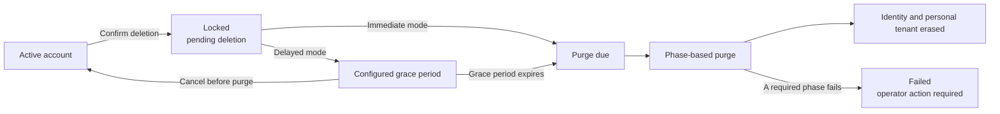

# Security and data lifecycle

This document explains how Flowork protects application data, where that data
is stored, and what happens when a user requests account deletion. It is
intended for self-hosting administrators, security reviewers, and developers
integrating Flowork into a wider infrastructure environment.

Flowork is alpha software. The controls described here are implemented in the
current repository, but a secure production deployment still depends on the
operator-provided database, object storage, KMS, network, backup, audit, and
monitoring configuration described in the [production deployment guide](../DEPLOY.md).

## Security model

Flowork separates platform management from Agent and Workflow execution. The
control plane authenticates each request, resolves the active Organization, and
checks access before reading data or performing an operation. Agent and
Workflow code runs through `sandboxd` rather than inside the API process.

The main protection layers are:

- **Server-derived identity and tenant context.** A client or sandbox cannot
  choose its own Organization by supplying an untrusted identifier.
- **Layered authorization.** OpenFGA evaluates resource relationships, while
  PostgreSQL row-level security independently restricts tenant-scoped rows.
- **Isolated execution.** Agent and Workflow processes receive only the files,
  credentials, and network access required for the current operation.
- **Separated durable and transient state.** PostgreSQL and object storage are
  authoritative; Valkey, queues, live sandboxes, and snapshots provide
  coordination or resumability and do not establish identity or permission.
- **Fail-closed production validation.** Production startup checks require the
  configured security services, including the account-purge worker and verified
  encrypted backups.

For the component and network boundaries, see
[Authorization and execution boundaries](architecture.md#authorization-and-execution-boundaries)
and [Network boundaries](architecture.md#network-boundaries). The executable
production checks are defined in the
[security profile](../api/src/vibecanvas_api/security_profile.py).

## Data locations

| Store | Typical contents | Lifecycle behavior |
| --- | --- | --- |
| **PostgreSQL** | Users, Organizations, memberships, Chats, Workflows, versions, runs, Tasks, Deployments, Knowledge package metadata and derived search chunks, authorization state, and audit records | Tenant-scoped business rows are protected by RLS. Account erasure removes the personal tenant and user-scoped identity data; Organization-owned content follows the rules described below. |
| **Object storage** | VFS file content, authoritative Knowledge package files, generated artifacts, run files, and Task outputs | Objects use tenant, resource, or Task prefixes. Account erasure removes the personal-tenant prefixes and the user's mounted-file objects. |
| **Runtime checkpoints** | LangChain checkpoints and compatibility state used to resume a Chat | Personal-tenant state is removed. Checkpoints for Chats created by the deleted user in another Organization are removed without deleting that Organization. |
| **Valkey** | Celery broker data, short-lived event copies, locks, and transient coordination | User and personal-tenant keys are removed where they can be addressed directly. Remaining queue messages are bounded by broker policy and cannot restore a deleted identity or authorization capability. |
| **Sandbox and host storage** | Live or hibernated runtime state, overlay directories, VFS volumes, SDK state, and user-mounted files | Locally owned sandboxes are closed, file synchronization is stopped, and validated user and personal-tenant directories are removed. Ordinary sandbox leases and TTLs remain a secondary cleanup boundary. |
| **OpenFGA** | Relationship tuples and the change feed used for resource authorization | Tuples for the user and personal-tenant resources are removed and verified absent. Identity-bearing rows in OpenFGA's retained change feed are then erased through a dedicated database function. Local authorization revisions are deleted or stripped of the erased user identifier. |
| **Audit log** | Security-relevant action, outcome, time, actor, request, and target context | The row is retained for audit continuity, but fields that identify or correlate the erased account are cleared. Only non-identifying action, outcome, and timestamp information remains. |
| **Backups** | Encrypted historical snapshots managed by the deployment operator | Active stores are erased by the application. Backup copies remain until the operator's documented retention period expires; the application cannot remove an immutable backup early. |

PostgreSQL is the system of record. Deleting a browser cache, a live sandbox, or
a Valkey key does not by itself delete the corresponding durable resource.
Likewise, a purge job is not complete until every required active-store phase
has succeeded.

## Account deletion

### Before a request is accepted

Account deletion is a high-risk operation. The API requires an authenticated
session with recent step-up authentication, and the user must enter the current
account email address exactly.

A user cannot delete the account while they are the last active Owner of a
non-personal Organization. Ownership must first be transferred to another
active member, or the Organization must be deleted. This prevents an account
request from leaving shared resources without an accountable Owner.

The request checks and Organization-owner preflight are implemented in the
[authentication route](../api/src/vibecanvas_api/routes/auth.py) and
[authentication repository](../api/src/vibecanvas_api/auth/repo.py).

### Request lifecycle

Once the request is accepted, Flowork immediately:

1. changes the account status to `pending_deletion`;
2. invalidates all Web sessions and rejects new login attempts;
3. disables personal-tenant Deployments, Task schedules, service accounts,
   model credentials, and MCP servers;
4. records an encrypted deletion request and a durable purge job; and
5. schedules physical erasure according to the deployment's deletion mode.

The deletion request stores no plaintext email snapshot. The confirmation email
is encrypted with a content key until the request is cancelled or the hard
deletion removes the request and its key.

### Immediate and delayed modes

| Mode | User-visible behavior | Cancellation |
| --- | --- | --- |
| **Immediate** | The account is locked immediately and the purge job becomes eligible to run at once. Physical erasure is asynchronous, so acceptance of the request does not mean every store has already been cleared. | Not supported after the request is accepted. |
| **Delayed** | The account is locked immediately, but physical erasure waits for the configured grace period. | Supported only before the purge begins and requires password verification. Resources that were enabled when deletion was requested are re-enabled; invalidated sessions are not restored. |

`ACCOUNT_DELETION_MODE` selects `immediate` or `delayed` and defaults to
`immediate`. In delayed mode, `ACCOUNT_DELETION_RETENTION_DAYS` controls the
grace period, defaults to 14 days, and accepts values from 1 through 365.

Cancellation is not a data-recovery mechanism. Once physical purge work has
started, deleted checkpoints, files, or external state must not be assumed to
be recoverable.

### What is erased

The purge worker processes the following durable phases in order:

1. **Runtime state:** closes the user's locally owned sandboxes, stops mounted
   directory synchronization, and removes matching checkpoints, runtime
   volumes, overlays, and host-side user directories.
2. **Object storage:** deletes personal-tenant VFS, Knowledge, run, batch,
   Skill, Task, scratch, and runtime-object prefixes, together with objects from
   the user's shared mount.
3. **Valkey:** removes addressable authentication, user, and personal-tenant
   keys.
4. **Authorization:** removes and verifies OpenFGA tuples, erases matching
   identity-bearing change-feed rows through a least-privilege maintenance
   role, and removes local authorization edges that could continue to grant
   access or retain the erased user identifier.
5. **Database:** removes personal-tenant business data and user-scoped identity,
   session, passkey, membership, preference, and OAuth rows.
6. **Backup retention:** records the boundary between erased active stores and
   encrypted backups that must age out under operator policy.

After all phases succeed, the worker scrubs identifying audit fields, removes
the user row, deletion request, purge job, personal content-encryption keys, and
personal tenant, and records a non-identifying purge-completion audit event.

The authoritative phase list and handlers are in the
[purge state machine](../api/src/vibecanvas_api/security/purge.py). The periodic
[maintenance task](../api/src/vibecanvas_api/celery_tasks/data_purge.py) claims
due jobs from PostgreSQL.

### Personal data and Organization-owned content

Account deletion does not delete business content owned by another
Organization merely because the departing user created it. For non-personal
Organizations, Flowork:

- removes the user's membership and other identity-scoped records;
- removes the user's Chat runtime checkpoints and user-specific runtime files;
- retains Organization-owned Workflows, Chats, Tasks, Deployments, Knowledge,
  and stored files; and
- replaces creator or actor references with a fixed, disabled, non-identifying
  Organization placeholder where a business row still requires an owner
  reference.

This preserves shared business records without retaining a link to the deleted
identity. Content in the user's personal Organization follows the full-erasure
path instead.

### Audit records and backups

Audit rows remain append-only during normal operation. The account-erasure path
uses a narrowly scoped database function that clears the tenant, user, email,
IP address, user-agent, request, target, metadata, lookup hashes, and encrypted
private payload from matching rows. The action, outcome, and timestamp remain
so operators can demonstrate that a security-relevant event occurred without
retaining the deleted identity.

The database boundary is defined in the
[account-erasure migration](../api/alembic/versions/120_account_erasure_policy.py).

Backups are different from active application stores. Flowork can delete active
database rows and objects, but it cannot selectively rewrite an immutable
operator-managed backup. Self-hosters must therefore publish and enforce a
backup-retention period, encrypt retained backups, restrict restore access, and
ensure that data restored from an older backup is reconciled with completed
erasure requests before the environment serves traffic.

## Purge reliability and operator responsibilities

Account erasure uses a PostgreSQL-backed state machine rather than a single
best-effort request. Each phase is committed separately. If a worker exits, an
expired lease allows another worker to continue from the recorded phase
boundary. A job is finalized only after all phases have completed.

A phase error moves the job to `failed`, stores a redacted diagnostic, and emits
a failure audit event. Failed jobs are not retried automatically; an operator
must investigate and explicitly requeue them. Operators should alert on failed
or overdue purge jobs and must not treat the locked account state as proof that
physical erasure finished.

Production deployments must:

- keep `PURGE_WORKER_ENABLED=true` and run both Celery Beat and a worker that
  consumes the `maintenance` queue;
- provide working database, object-store, Valkey, OpenFGA, checkpoint, sandbox,
  and host-storage cleanup paths used by the deployment;
- provision `public.flowork_erase_changelog` in OpenFGA's PostgreSQL datastore
  and set `OPENFGA_ERASURE_DATABASE_URL` to a role that can execute only that
  function. Docker Compose and the native launcher do this automatically;
- set `BACKUP_ENCRYPTION_VERIFIED=true` only after encryption and restore tests
  have actually been completed;
- document the selected deletion mode, grace period, and backup expiry; and
- test the complete lifecycle with synthetic accounts, including failure
  alerting, Organization ownership transfer, and delayed-mode cancellation when
  that mode is enabled.

The implementation invariants are covered by the
[account-deletion tests](../api/tests/test_account_deletion.py) and
[purge state-machine tests](../api/tests/security/test_purge_state_machine.py).

## Reporting vulnerabilities

Do not report suspected vulnerabilities through public issues, discussions, or
pull requests. Follow the private disclosure process in the
[security policy](../SECURITY.md), and do not include real user data or active
credentials in a report.
